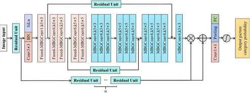
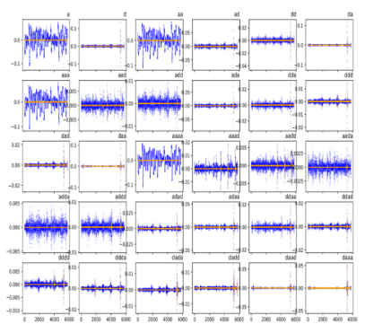

# EGA Voiceprint Classification

This repository provides an implementation of the EGA (Efficient Global Attention) network with IGAM (Improved Global Attention Module), designed for classification of spectrograms in voiceprint-based fault detection.


## EGA network module




## Data noise reduction preprocessing




# Usage

## 📌 Project Structure

```angular2html
EGA_Voiceprint_Classification/
├── models/
│   ├── ega_net.py
│   ├── igam_module.py
│   └── mbg_conv.py
├── dataset/
│   ├── private_dataset.py
│   └── augmentation.py
├── utils/
│   ├── train_utils.py
│   └── visualize.py
├── configs/
│   └── default.yaml
├── train.py
├── evaluate.py
├── requirements.txt
└── README.md
```
## Requirements

```angular2html
pip install -r requirements.txt
```

## Train the model

```angular2html
python train.py
```

## Evaluate the model

```angular2html
python evaluate.py
```

## Configuration

```angular2html
Modify configs/default.yaml to set batch size, learning rate, epochs, etc.
```
## Dataset Format

Prepare a folder data/ containing:

    train/ and test/ directories with audio files
    
    train_labels.csv and test_labels.csv, format:
    
    filename.wav,0
    another.wav,1

